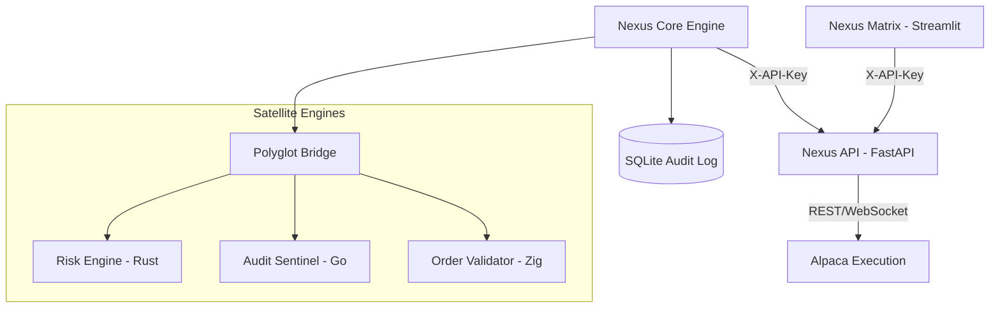

# Nexus Hardened Institutional Quantitative Platform (v2.0)

Nexus is a production-grade, 24/7 autonomous trading intelligence platform. Version 2.0 introduces industrial-grade security, persistent audit trails, and deterministic quantitative modeling.

## 🏛 Architecture

Nexus utilizes a high-performance polyglot architecture (Python, Rust, Go, Zig) with a hardened FastAPI backend and a glassmorphic Streamlit matrix.



## 🛡️ Hardening Features (v2.0)

- **API Security**: Authentication middleware on all mutation endpoints using `X-API-Key`.
- **CORS Lock**: Restricted browser access to the Streamlit origin only.
- **Persistence**: All governance audits and trade history are persisted to `data/nexus_audit.db`.
- **Deterministic AI**: Removed random confidence stubs; replaced with Ensemble Strategy Agreement.
- **Real Monte Carlo**: Active path simulation for survival analysis and ruin probability.
- **Cross-Platform**: Full support for Windows, Linux, and macOS (Polyglot portability fixed).

## 🚀 Deployment

### Prerequisites
- Python 3.11+
- Alpaca API Credentials
- Docker & Docker Compose (Optional, for containerized run)

### Standard Setup
```bash
# 1. Install dependencies
pip install -r requirements.txt

# 2. Configure credentials
cp .env.example .env
# Set ALPACA_API_KEY, ALPACA_API_SECRET, and NEXUS_API_KEY

# 3. Verify Hardening
python verify_production_ready.py
```

### Docker Deployment
```bash
docker-compose up --build -d
```

## 📊 Dashboard
The Streamlit matrix provides real-time visibility into:
- **Market Intelligence**: Regime detection, Ensemble agreement, and Quantitative sentiment.
- **Institutional Holdings**: Live P&L tracking from Alpaca.
- **Audit Log**: Real-time compliance monitoring from the GovernanceEngine.

## 🛡 Verification & Quality
```bash
# Run the 27-point comprehensive audit
python verify_production_ready.py

# Run the test suite
pytest tests/
```

---
**Status:** `PRODUCTION_READY` | **Version:** `2.0.0` | **Security:** `HARDENED`
