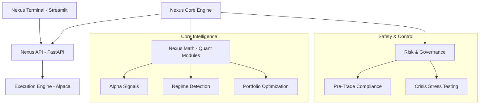

# Nexus Institutional Quantitative Platform

Nexus is an institutional-grade quantitative trading and intelligence platform designed for high-fidelity market analysis and execution. Built for professional researchers and traders who prioritize technical excellence and empirical rigor over marketing aesthetics.

## 🏛 Architecture

Nexus follows a decoupled, layered architecture to ensure scalability, reliability, and ease of research-to-production deployment.



## 🧩 Core Modules

### Nexus Math
A suite of advanced mathematical modules implementing institutional quantitative techniques:
- **State-Space Denoising**: Kalman Filtering for signal extraction and price smoothing.
- **Intensity Modeling**: Hawkes Processes for volatility clustering and market toxicity detection.
- **Topological Analysis**: Mapper-based market shape detection (TDA).
- **Fractal Geometry**: Hurst-based trend persistence measurement.

### Nexus Core
The central orchestration layer managing the end-to-end trading lifecycle:
- **Governance Engine**: Multi-layer compliance gate (Concentration, Drawdown, Blacklist).
- **Alpha Engine**: Parallelized signal generation and intensity-scaled sizing.
- **Execution AI**: Reinforcement Learning (DDQN proxy) based order routing.

## 🚀 Deployment

### Prerequisites
- Python 3.9+
- Alpaca API Credentials (Paper or Live)

### Setup
```bash
# Clone the repository
git clone https://github.com/your-repo/nexus.git
cd nexus

# Install institutional dependencies
pip install -r requirements.txt

# Configure environment
echo "ALPACA_API_KEY=your_key" > .env
echo "ALPACA_API_SECRET=your_secret" >> .env
```

### Execution
Launch the unified platform orchestrator:
```bash
python nexus_orchestrator.py
```
This initializes the API (Port 8000), Core Engine, and Terminal UI (Port 8501).

## 🛡 Verification & Quality

Nexus maintains strict institutional quality standards:
- **Automated Testing**: Comprehensive test suite for all mathematical and core logic.
- **CI/CD**: GitHub Actions pipeline for linting (Ruff), type checking (MyPy), and unit tests (Pytest).
- **Audit Trails**: Every trade and compliance check is logged with high-precision timestamps.

```bash
# Run verification suite
pytest tests/
```

---
**Status:** `STABLE` | **Version:** `1.0.0` | **License:** Institutional
