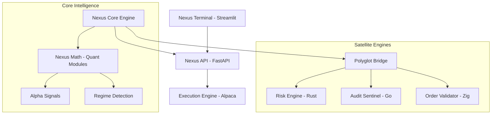

# Nexus Institutional Quantitative Platform

Nexus is an institutional-grade quantitative trading and intelligence platform designed for high-fidelity market analysis and execution. Built for professional researchers and traders who prioritize technical excellence and empirical rigor over marketing aesthetics.

## 🏛 Architecture

Nexus follows a high-performance, polyglot architecture utilizing specialized runtimes for critical tasks.



## 🧩 Core Modules

### Nexus Math

A suite of advanced mathematical modules implementing institutional quantitative techniques:

- **State-Space Denoising**: Kalman Filtering for signal extraction.
- **Intensity Modeling**: Hawkes Processes for volatility clustering.
- **Topological Analysis**: Mapper-based market shape detection (TDA).

### Polyglot Satellites

High-speed satellite services for critical-path operations:

- **Rust Risk Engine**: Sub-millisecond Value-at-Risk (VaR) calculations.
- **Go Audit Sentinel**: Parallel health and integrity monitoring of all services.
- **Zig Order Validator**: Hardware-level order verification and compliance checks.

### Nexus 24/7 Autonomous Manager

The platform is designed for continuous, unattended institutional operation:

- **Auto-Recovery**: Automatic restart of services on failure.
- **Sentinel Monitoring**: Heartbeat monitoring and process health tracking.
- **24/7 Mode**: Override for market sessions to allow continuous signal monitoring.

## 🚀 Deployment

### Prerequisites

- Python 3.11+
- Alpaca API Credentials (Paper or Live)
- Go (for Audit Sentinel recompilation)
- Rust & Zig (optional, for satellite modification)

### Setup

```bash
# Clone and install dependencies
pip install -r requirements.txt

# Configure environment
cp .env.example .env # Ensure credentials are set
```

### Execution

### Execution Modes

#### Option 1: Standard Orchestrator

```bash
python nexus_orchestrator.py
```

#### Option 2: 24/7 Autonomous Mode (Recommended)

```bash
python nexus_24_7.py
```

#### Option 3: Quick Start Menu

```bash
python nexus_24_7_menu.py
```

## 🛡 Verification & Quality

Nexus maintains strict institutional quality standards:

- **Production Readiness**: `verify_production_ready.py` runs a 27-point comprehensive audit.
- **Unit Testing**: `pytest tests/` for core and institutional logic validation.
- **Linting**: Ruff and MyPy enforcement for codebase professionalization.

```bash
# Run verification suite
pytest tests/
```

---
**Status:** `STABLE` | **Version:** `1.0.0` | **License:** Institutional
