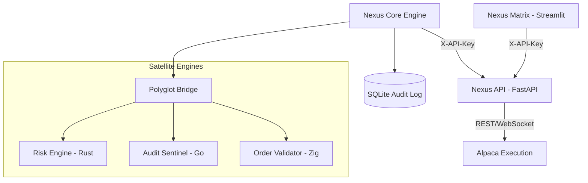

# Nexus Hardened Institutional Quantitative Platform (v2.0)

Nexus is a production-grade, 24/7 autonomous trading intelligence platform. Version 2.0 introduces industrial-grade security, persistent audit trails, and deterministic quantitative modeling.

## 🏛 Architecture

Nexus utilizes a high-performance polyglot architecture (Python, Rust, Go, Zig) with a hardened FastAPI backend and a glassmorphic Streamlit matrix.


```mermaid
graph TD
    UI[Nexus Matrix - Streamlit] -- X-API-Key --> API[Nexus API - FastAPI]
    API -- REST/WebSocket --> EXEC[Alpaca Execution]
    ENG[Nexus Core Engine] -- X-API-Key --> API
    ENG --> DB[(SQLite Audit Log)]
    ENG --> BRIDGE[Polyglot Bridge]
    
    subgraph "Satellite Engines"
    BRIDGE --> RUST[Risk Engine - Rust]
    BRIDGE --> GO[Audit Sentinel - Go]
    BRIDGE --> ZIG[Order Validator - Zig]
    end
```

## 🛡️ Hardening Features (v2.0)

- **API Security**: Authentication middleware on all mutation endpoints using `X-API-Key`.
- **CORS Lock**: Restricted browser access to the Streamlit origin only.
- **Persistence**: All governance audits and trade history are persisted to `data/nexus_audit.db`.
- **Deterministic AI**: Removed random confidence stubs; replaced with Ensemble Strategy Agreement.
- **Real Monte Carlo**: Active path simulation for survival analysis and ruin probability.
- **Cross-Platform**: Full support for Windows, Linux, and macOS (Polyglot portability fixed).

## 🚀 Deployment

### Prerequisites

- Python 3.11+
- Alpaca API Credentials
- Docker & Docker Compose (Optional, for containerized run)

### Standard Setup

```bash
# 1. Install dependencies
pip install -r requirements.lock.txt
# or use requirements.txt for a looser install constraint
# pip install -r requirements.txt

# 2. Configure credentials
cp .env.example .env
# Set ALPACA_API_KEY, ALPACA_API_SECRET, and NEXUS_API_KEY

# 3. Verify Hardening
python verify_production_ready.py
```

### Docker Deployment

```bash
docker-compose up --build -d
```

## 📊 Dashboard
The Streamlit matrix provides real-time visibility into:

- **Market Intelligence**: Regime detection, Ensemble agreement, and Quantitative sentiment.
- **Institutional Holdings**: Live P&L tracking from Alpaca.
- **Audit Log**: Real-time compliance monitoring from the GovernanceEngine.

## 💾 Data Lake Quick Start
The new Data Engine (Phase 1) provides a complete pipeline to ingest, validate, and query market data:
```python
from nexus.data.ingestion.yahoo import YahooFinanceSource
from nexus.data.storage.parquet_writer import ParquetWriter
from nexus.data.storage.duckdb_helper import DuckDBHelper
from nexus.data.validation.pipeline import ValidationPipeline
from datetime import datetime

# 1. Ingest Data
source = YahooFinanceSource()
df = source.fetch_historical_ohlcv(["AAPL"], datetime(2023,1,1), datetime(2023,2,1))

# 2. Validate Quality
pipeline = ValidationPipeline()
passed, clean_df = pipeline.validate_batch(df)

# 3. Store as partitioned Parquet
writer = ParquetWriter()
writer.write_ohlcv(clean_df, source="yahoo")

# 4. Query via DuckDB
db = DuckDBHelper()
result = db.query("SELECT symbol, count(*) FROM market_data GROUP BY symbol").df()
print(result)
```

## 🛡 Verification & Quality

```bash
# Run the 27-point comprehensive audit
python verify_production_ready.py

# Run the test suite
pytest tests/
```

---
> Performance claims should be validated with audited historical and live track records. This platform targets superior risk-adjusted returns but does not promise any specific annualized performance.

**Status:** `PRODUCTION_PREPARED` | **Version:** `2.0.0` | **Security:** `HARDENED`
