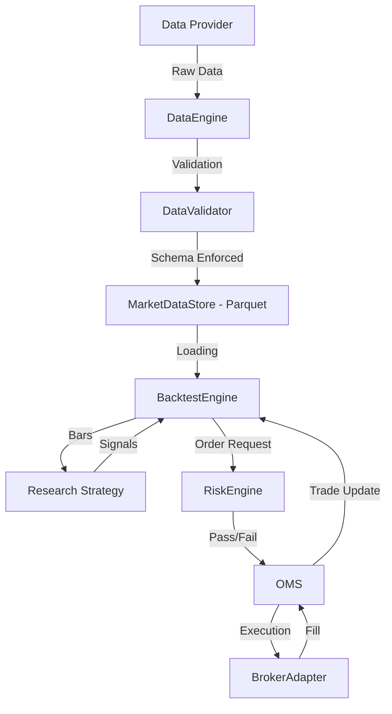

# Nexus Platform Architecture

The Nexus platform is designed as an institutional-grade quantitative research and execution engine. It follows a strict **8-layer modular architecture** to ensure separation of concerns, reproducibility, and high-performance execution.

## 1. Core Architecture (8 Layers)

| Layer | Responsibility | Key Components |
| :--- | :--- | :--- |
| **Models** | Single Source of Truth for entities | `MarketBar`, `Order`, `Trade`, `Position` |
| **Core** | Shared utilities and singleton state | `NexusContext`, `EnterpriseLogger`, `SecretsManager` |
| **Data** | Ingestion, validation, and storage | `DataEngine`, `MarketDataStore`, `DataValidator` |
| **Research** | Strategy logic and signal generation | `BaseAlpha`, `Signal`, `MomentumAlpha` |
| **Backtest** | Event-driven simulation | `BacktestEngine`, `PortfolioTracker`, `CostModel` |
| **Execution** | Order lifecycle and routing | `OMS`, `BrokerAdapter`, `PaperBroker` |
| **Risk** | Pre/Post-trade guardrails | `RiskEngine`, `SectorConcentrationRule` |
| **Monitoring** | Observability and performance | `TelemetrySystem`, `LatencyProfiler` |

---

## 2. Elite Data Flow

---

## 3. Advanced Capabilities

### Almgren-Chriss Market Impact
Unlike simple backtesters, Nexus implements the **Almgren-Chriss Optimal Execution** model. This accounts for:
*   **Permanent Impact**: The permanent shift in price due to information leakage (Linear).
*   **Temporary Impact**: The temporary price dissipation due to liquidity consumption (Square-root).

### Institutional Risk Controls
The `RiskEngine` enforces rules used by top-tier firms (Citadel/XTX):
*   **Sector Concentration**: Prevents over-exposure to correlated asset groups.
*   **Gross Leverage**: Hard-stop on margin utilization.
*   **Drawdown Kill-Switch**: Automatic system halt if peak-to-trough losses exceed limits.

---

## 4. Operation & Reproduction

Nexus is built for **Full Reproducibility**.
1.  **Parquet Caching**: Every backtest run uses identical, validated data stored in the local cache.
2.  **Deterministic Testing**: The `BacktestEngine` uses a seeded event loop to ensure identical results across runs.
3.  **Dockerized Environment**: The entire stack (Engine, Logs, Data) is containerized for seamless deployment.
