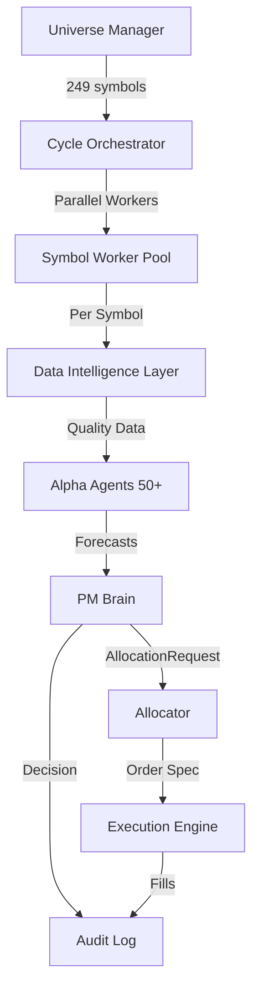

# Decision Flow Documentation

## Overview

This document describes the end-to-end decision flow for the institutional-grade trading engine, from data ingestion to order execution.

## High-Level Architecture



## Detailed Decision Flow

### Phase 1: Data Acquisition

1. **Provider Selection** (Provider Bandit)
   - UCB1 algorithm selects best provider based on:
     - Success rate
     - Latency
     - Quality scores
     - Confidence from ConfidenceAgent
   - Respects quota limits (daily_cap = ceil(monthly_quota / 30))

2. **Data Fetch** (Data Router)
   - Fetches OHLCV data from selected provider
   - Records latency and provider metadata
   - Returns empty DataFrame on failure

3. **Quality Check** (Quality Agent)
   - Schema validation (required columns present)
   - Missingness check (< 10% missing)
   - Flash spike detection (> 30% single-day move)
   - Zero price detection
   - Returns: `(is_usable, quality_score, reasons)`

4. **Confidence Update** (Confidence Agent)
   - Updates provider confidence using EMA: `C_t+1 = α * C_t + (1-α) * success`
   - Persists to `runtime/provider_confidence.json`
   - Returns current confidence score

5. **Provider Bandit Update**
   - Records success/failure, latency, quality score
   - Updates UCB1 statistics for next selection

**Decision Points:**
- **NO_DATA**: Empty DataFrame → REJECT
- **DATA_QUALITY_FAIL**: quality_score < 0.6 → REJECT
- **LOW_PROVIDER_CONFIDENCE**: confidence < 0.5 → REJECT

---

### Phase 2: Alpha Generation

6. **Agent Execution** (50+ Agents)
   - Each agent evaluates symbol independently
   - Returns `AgentResult(mu, sigma, confidence, metadata)`
   - Agents include:
     - Technical: Momentum, Mean Reversion, Volatility, Trend, Breakout, RSI, MACD, Bollinger
     - Statistical: StatArb, Cointegration, Pairs, Kalman, Hurst, Fractal
     - Fundamental: Growth, Value, Quality, Macro, Yield Curve, Inflation
     - Alternative: Sentiment, News, Earnings, Options Flow, Dark Pool
     - Advanced: RL, LSTM, Transformer, Graph Networks, Adversarial, Evolutionary
     - Specialized: ESG, Supply Chain, Regulatory, M&A, Spin-offs, Insider
     - Micro: Order Book, Trade Flow, Spread Capture, Latency Arb
     - Meta: Ensemble, Mixture of Experts, Meta-Labeling

7. **Agent Filtering**
   - Filter out agents with confidence = 0
   - If all agents have zero confidence → REJECT

**Decision Points:**
- **NO_ALPHA_SIGNALS**: No agents returned results → REJECT
- **ALL_AGENTS_ZERO_CONFIDENCE**: All confidence = 0 → REJECT

---

### Phase 3: PM Brain Aggregation

8. **Signal Aggregation**
   - Equal-weighted mean: `μ_hat = Σ(μ_i) / N`
   - Independent variance: `σ_hat = sqrt(Σ((w * σ_i)^2))`
   - Average confidence: `conf_avg = Σ(conf_i) / N`

9. **Conviction Z-Score** (MAD-based)
   - Compute median: `median(μ)`
   - Compute MAD: `median(|μ_i - median(μ)|)`
   - Z-score: `z = (μ_hat - median(μ)) / MAD`

10. **Risk-Adjusted Score**
    - Sharpe-like: `S = μ_hat / σ_hat`

11. **Disagreement Penalty**
    - Variance-based penalty from ModelDisagreement
    - Penalizes high variance across agent forecasts

12. **Opportunity Cost**
    - Compute marginal Sharpe contribution
    - Compare against next-best alternative from universe
    - Reject if alternative is > 20% better

13. **PM Score**
    - `PM_score = Sharpe * disagreement_penalty`

**Decision Points:**
- **LOW_CONFIDENCE**: avg_confidence < 0.5 → HOLD
- **OPPORTUNITY_COST_FAIL**: Better alternative exists → REJECT
- **LOW_PM_SCORE**: PM_score < 0.05 → REJECT
- **LOW_CONVICTION_ZSCORE**: z-score < -2.0 → REJECT

---

### Phase 4: Allocation

14. **AllocationRequest Creation**
    - If all PM Brain checks pass, create frozen dataclass:
      ```python
      AllocationRequest(
          symbol, mu, sigma, confidence,
          liquidity, regime, timestamp, metadata
      )
      ```

15. **Allocator Sizing**
    - Fractional Kelly: `f = γ * μ / σ^2` (γ = 0.15 default)
    - Clip to max position: `weight = min(f, 0.10)`
    - Confidence adjustment: `weight *= confidence`
    - Returns order spec dict with quantity, order_type, etc.

16. **Impact Model Check** (TODO)
    - Estimate permanent + temporary impact
    - Reduce size if impact > threshold

**Decision Points:**
- **ZERO_ALLOCATION**: Allocator returns quantity ≤ 0 → REJECT

---

### Phase 5: Execution

17. **Order Creation**
    - Create `OrderInfo(action, quantity, order_type, ...)`
    - Action determined from signal direction (BUY/SELL)
    - Order type from execution strategy (MARKET/LIMIT/POV/TWAP)

18. **Execution Strategy** (Execution RL)
    - Rule-based selection:
      - High urgency or small size → MARKET
      - High participation → TWAP
      - High volatility → POV
      - Default → LIMIT

19. **Final Decision**
    - Create `Decision` object with:
      - `final_decision = EXECUTE`
      - `order = OrderInfo(...)`
      - `reason_codes = ["PM_SCORE_PASS", ...]`
      - `metadata = {...}` (all PM brain stats)

---

### Phase 6: Audit

20. **Audit Record Generation**
    - Convert `Decision` to `DecisionRecord` dataclass
    - Extract provider metadata, alpha results, risk checks
    - Compute conviction z-score

21. **Dual Write**
    - Write to JSONL: `runtime/audit.log`
    - Write to SQLite: `runtime/audit.db`
    - Thread-safe with lock

---

## Decision Enum Values

| Decision | Meaning | When Used |
|----------|---------|-----------|
| **EXECUTE** | Trade approved, order created | Passed all checks |
| **HOLD** | Don't trade now, but don't reject | Low confidence, wait for better signal |
| **REJECT** | Don't trade, fundamentally bad | Failed quality, PM score, opportunity cost |
| **ERROR** | System error occurred | Exception in worker, allocator, etc. |

---

## Reason Codes

### Data Layer
- `NO_DATA`: Provider returned empty DataFrame
- `DATA_QUALITY_FAIL`: Quality score < threshold
- `LOW_PROVIDER_CONFIDENCE`: Provider confidence < 0.5
- `MISSING_COLUMNS`: Required OHLCV columns missing
- `FLASH_SPIKE_DETECTED`: > 30% single-day move
- `ZERO_PRICE_DETECTED`: Price ≤ 0

### Agent Layer
- `NO_ALPHA_SIGNALS`: No agents returned results
- `ALL_AGENTS_ZERO_CONFIDENCE`: All agents have confidence = 0
- `ALL_AGENTS_FAILED`: All agents raised exceptions

### PM Brain Layer
- `LOW_CONFIDENCE_{value}`: Average confidence < 0.5
- `OPPORTUNITY_COST_FAIL`: Better alternative exists
- `LOW_PM_SCORE_{value}`: PM score < threshold
- `LOW_CONVICTION_ZSCORE_{value}`: Z-score < -2.0
- `PM_SCORE_PASS`: Passed all PM checks

### Allocation Layer
- `ZERO_ALLOCATION`: Allocator returned quantity ≤ 0

### System Layer
- `WORKER_CRASH`: Exception in symbol worker
- `ALLOCATOR_ERROR`: Exception in allocator
- `ORCHESTRATOR_RETRIEVAL_FAIL`: Failed to get result from worker

---

## Audit Schema

### DecisionRecord Fields

```python
@dataclass
class DecisionRecord:
    cycle_id: str                    # Unique cycle identifier
    symbol: str                      # Symbol traded
    timestamp: str                   # ISO timestamp
    data_providers: Dict[str, float] # {provider: confidence}
    alphas: Dict[str, float]         # {agent: mu}
    sigmas: Dict[str, float]         # {agent: sigma}
    conviction: float                # PM score
    conviction_zscore: float         # MAD-based z-score
    risk_checks: List[str]           # Risk check results
    pm_override: str                 # "ALLOW" or "REJECT"
    final_decision: str              # EXECUTE/HOLD/REJECT/ERROR
    order: Optional[Dict]            # Order details if EXECUTE
    reason_codes: List[str]          # Decision reasons
    raw_traceback: Optional[str]     # Exception traceback if ERROR
```

### Example Audit Record

```json
{
  "cycle_id": "2026-01-17T14:06:05Z",
  "symbol": "NVDA",
  "timestamp": "2026-01-17T14:06:05Z",
  "data_providers": {"polygon": 0.93},
  "alphas": {"momentum": 0.02, "fundamental": 0.01, "sequence": 0.03},
  "sigmas": {"momentum": 0.015, "fundamental": 0.02, "sequence": 0.01},
  "conviction": 0.025,
  "conviction_zscore": 1.7,
  "risk_checks": ["max_position_ok", "impact_ok"],
  "pm_override": "ALLOW",
  "final_decision": "EXECUTE",
  "order": {"action": "BUY", "quantity": 0.08, "order_type": "MARKET"},
  "reason_codes": ["PM_SCORE_PASS", "CONVICTION_ZSCORE_1.70"],
  "raw_traceback": null
}
```

---

## Performance Targets

- **Decision Generation Latency**: Median < 60s for 249 symbols (goal < 10s)
- **Decision Coverage**: 100% (every symbol gets a decision)
- **No Silent Failures**: All exceptions → ERROR with traceback
- **Provider Quota**: Respect daily caps, use fallback when exhausted
- **Data Quality**: > 60% of fetches pass quality checks

---

## Error Handling

### Principle: Never Drop Symbols

- **Old Behavior**: Symbol fails → remove from universe
- **New Behavior**: Symbol fails → REJECT decision with reason
- **Rationale**: Auditability, transparency, no silent failures

### Exception Handling

All exceptions caught at symbol worker level:
```python
try:
    # ... pipeline ...
except Exception as e:
    return Decision(
        final_decision=ERROR,
        reason_codes=["WORKER_CRASH", str(e)],
        traceback=traceback.format_exc()
    )
```

### Fail-Safe Audit

Even if orchestrator fails to retrieve worker result:
```python
except Exception as e:
    fail_decision = Decision(
        final_decision=ERROR,
        reason_codes=["ORCHESTRATOR_RETRIEVAL_FAIL"]
    )
    write_audit(fail_decision.to_audit_record())
```

---

## Monitoring & Observability

### Metrics Collected

- `hft_cycles_total`: Total cycles run
- `hft_cycle_duration_seconds`: Cycle duration histogram
- `decisions_{EXECUTE/HOLD/REJECT/ERROR}`: Decision counts
- `data_provider_failures_{provider}`: Provider failure count
- `avg_conviction`: Average PM score
- `avg_quality_score`: Average data quality

### Logs

- **Structured JSON logs** for all decisions
- **Provider usage stats** per cycle
- **Data quality stats** per cycle
- **Bandit statistics** (success rate, latency, quality)

### End-of-Day Summary

Generated at cycle end:
```json
{
  "date": "2026-01-17",
  "cycles_run": 1,
  "total_decisions": 249,
  "decision_breakdown": {
    "EXECUTE": 45,
    "HOLD": 32,
    "REJECT": 168,
    "ERROR": 4
  },
  "provider_usage": {
    "polygon": 200,
    "yahoo": 49
  },
  "top_reject_reasons": [
    "LOW_PM_SCORE": 120,
    "OPPORTUNITY_COST_FAIL": 30,
    "DATA_QUALITY_FAIL": 18
  ]
}
```
